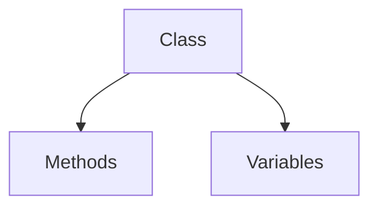
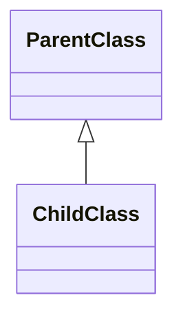
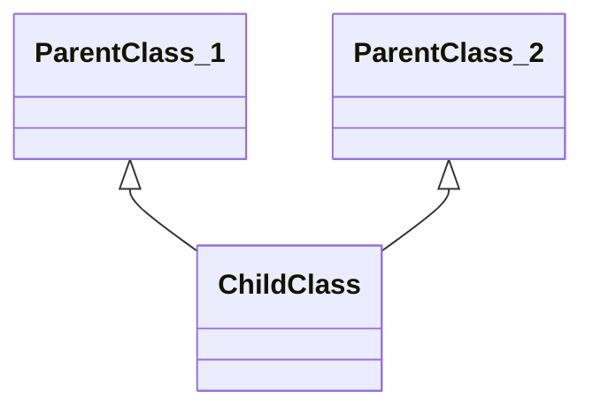
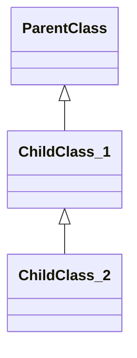
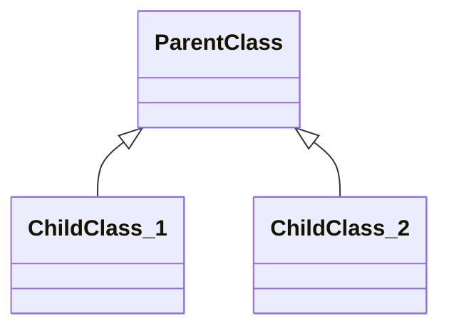
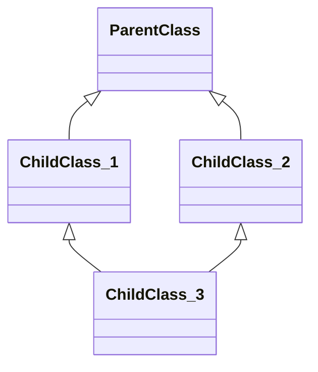
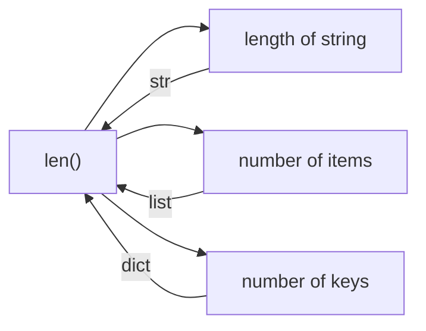
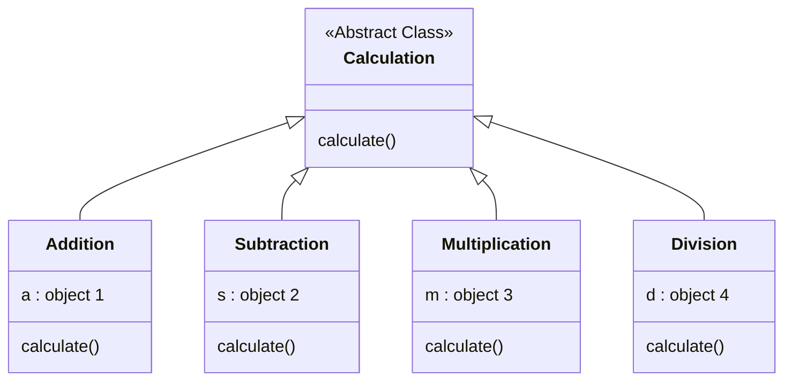

# 🐍 **Python OOP (Object-Oriented Programming) Notes**

### INSTRUCTOR: WAJAHAT HUSSAIN

_Object-Oriented Programming (OOP)_ is a programming paradigm that structures code around **objects**. Let's dive deep into its principles and how they’re implemented in Python! 🚀

## 🧩 **1. What is OOP?**

  

OOP structures code around **objects** rather than functions. Objects represent real-world entities and are instances of **classes**—the blueprints for creating objects.

### Core Concepts 📝
- **Classes** - Blueprints for objects
- **Objects** - Instances of classes; hold data and behavior
- **Attributes** - Data stored within an object
- **Methods** - Functions defining behaviors of an object


## 🔑 **2. Key OOP Principles in Python**

Let's break down the four main pillars of OOP with Python examples.

### **2.1 Encapsulation 🔒**
- **Definition**: Bundles data and functions within a class and restricts access from outside.
- **Purpose**: Protects internal state and simplifies the interface.



In the concept of **Encapsulation**, a **Class** in Python contains:
- **Methods**: Functions that define the behaviors of the class.
- **Variables**: Attributes that hold the data for the class.

#### Code Example:
```python
class Car:
    def __init__(self, brand, model):
        self.brand = brand      # Public attribute
        self.__model = model    # Private attribute

    def get_model(self):
        return self.__model
```


### **2.2 Inheritance 🧬**
- **Definition**: Allows a class (child) to inherit attributes and methods from another class (parent).
- **Purpose**: Enables code reuse and establishes an "is-a" relationship.

### Simple Inheritance

### Multiple Inheritance

### Multi-Level Inheritance

### Hierarchical Inheritance

### Hybrid Inheritance

#### Code Example:
```python
class Vehicle:
    def start_engine(self):
        print("Engine started")

class Car(Vehicle):  # Car inherits from Vehicle
    pass

my_car = Car()
my_car.start_engine()  # Inherits method from Vehicle
```


### **2.3 Polymorphism 🎭**
- **Definition**: Allows different classes to be treated as instances of the same class through shared methods.
- **Purpose**: Enables flexibility in function usage.
### Example Explaination
### `len()` Function Behavior



#### Code Example:
```python
class Bird:
    def sound(self):
        return "Chirp"

class Dog:
    def sound(self):
        return "Bark"

# Polymorphic function
def make_sound(animal):
    print(animal.sound())

make_sound(Bird())  # Chirp
make_sound(Dog())   # Bark
```

### **2.4 Abstraction 🎩**
- **Definition**: Hides complex details and shows only the essential aspects.
- **Purpose**: Simplifies code and reduces complexity.
### Abstract Class Example



#### Code Example:
```python
from abc import ABC, abstractmethod

class Animal(ABC):
    @abstractmethod
    def sound(self):
        pass

class Cat(Animal):
    def sound(self):
        return "Meow"
```

## 🔧 **3. Defining Classes and Objects in Python**

**Class Syntax**:
```python
class ClassName:
    def __init__(self, attribute1, attribute2):
        self.attribute1 = attribute1
        self.attribute2 = attribute2

    def method(self):
        pass
```

**Creating an Object**:
```python
my_object = ClassName(value1, value2)
```

### Real-World Example
```python
class Person:
    def __init__(self, name, age):
        self.name = name
        self.age = age

    def greet(self):
        return f"Hello, my name is {self.name}."

person1 = Person("Alice", 30)
print(person1.greet())  # Output: Hello, my name is Alice.
```

## ⚙️ **4. Constructors and Destructors**

- **Constructor (`__init__`)**: Initializes an object’s state.
- **Destructor (`__del__`)**: Cleans up resources when an object is deleted (less commonly used).

#### Code Example:
```python
class MyClass:
    def __init__(self):
        print("Object initialized")

    def __del__(self):
        print("Object deleted")

obj = MyClass()
del obj  # Triggers __del__
```

## 🎩 **5. Special/Magic Methods (Dunder Methods)**

Python's "magic" methods start and end with double underscores (`__`). These methods allow us to define custom behaviors for operators and built-in functions.

- `__str__()`: Defines behavior for `print()`
- `__add__()`: Defines behavior for `+`
- `__len__()`: Defines behavior for `len()`

#### Example:
```python
class Book:
    def __init__(self, title, pages):
        self.title = title
        self.pages = pages

    def __str__(self):
        return f"{self.title}, {self.pages} pages"

book = Book("Python Guide", 300)
print(book)  # Output: Python Guide, 300 pages
```

## 🌟 **6. Summary of OOP Concepts**

- **Classes and Objects**: Foundation of OOP.
- **Encapsulation**: Protects data within objects.
- **Inheritance**: Reuses code in a hierarchy.
- **Polymorphism**: Flexibility through shared method names.
- **Abstraction**: Hides complexity and reduces clutter.

Made with <3 by **WAJAHAT HUSSAIN**
